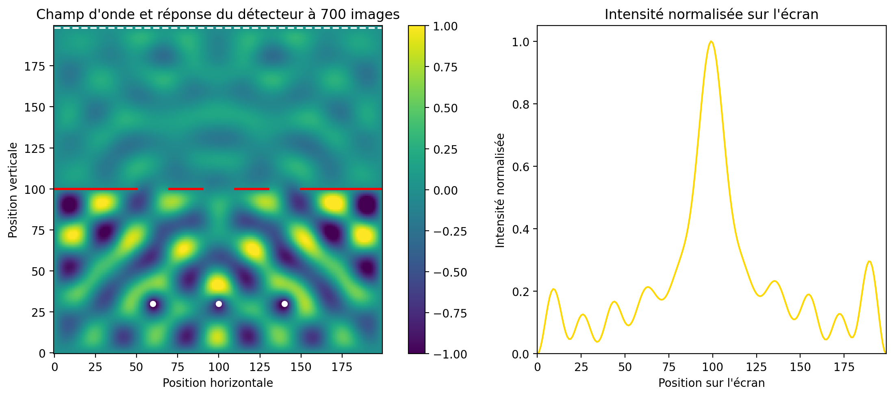
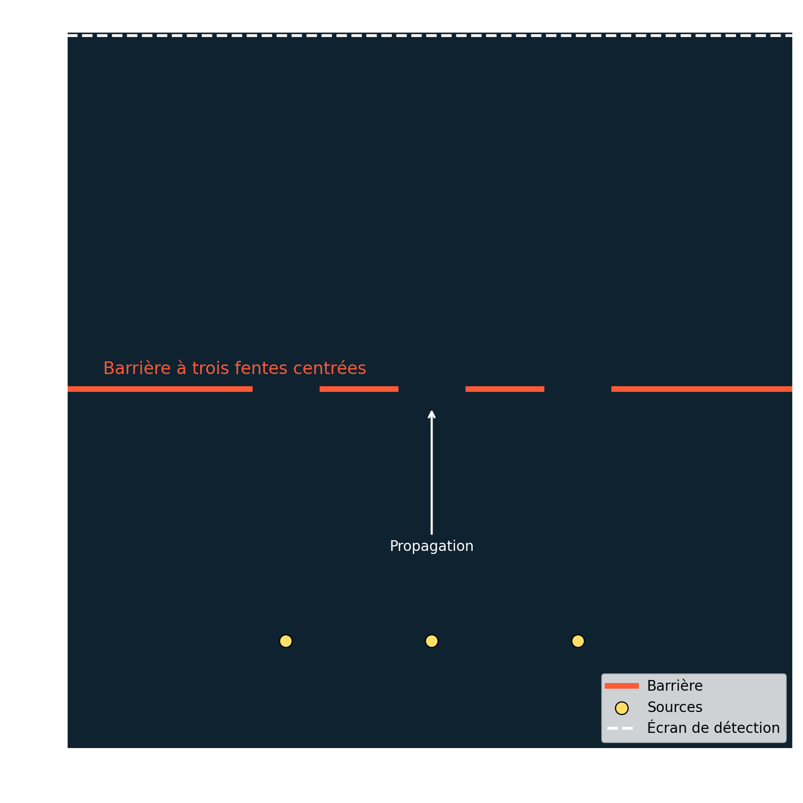

# huygens_info_03_oc
C'est une démo de la diffraction à travers deux fentes avec trois sources réalisée dans le cadre de la semestrielle d'OC informatique

# Utilisation
Assurez-vous d'avoir toutes les librairies installées:
```bash
pip install -r requirements.txt
```

Le projet contient 4 fichiers:
 - `main.py`: setup et affichage de la simulation
 - `interactive.py`: version interactive de `main.py`
 - `export_figures.py`: script pour exporter les figures utiles à la présentation
 - `huygens.py`: le coeur de la simulation, avec tous les calculs

Le projet principal est dans `main.py`, mais `interactive.py` est pour approfondir notre compréhension de python et matplotlib

Note: pour utiliser `interactive.py` il suffit de l'executer, un clic gauche ajoute une source, la touche Maj avec un clic gauche sert à rajouter des obstacles

# Images



